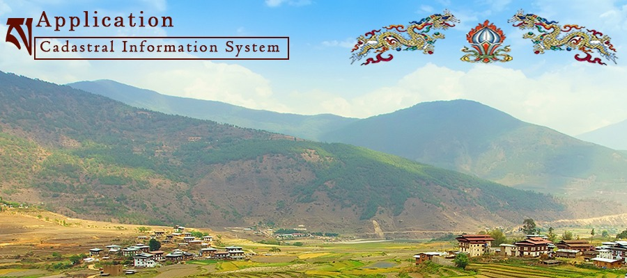
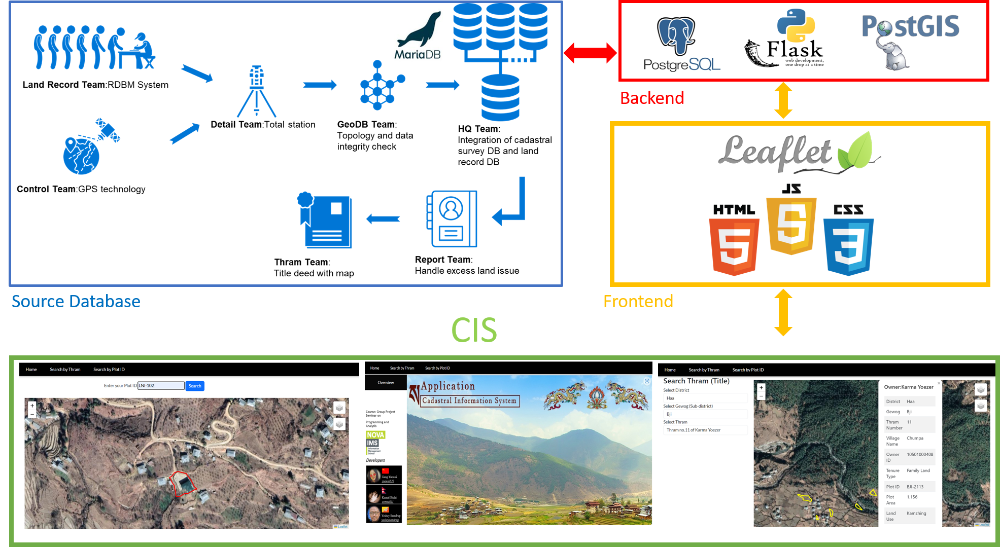

# Cadastral Information System of Bhutan

##  Content
---
- Introduction
- How to run this project
- Database
- Workflow

## Introduction
---
Usually, land ownwers could only check the information their thram in paper certificates, which is outdated, for example, a landowner attempts to see the reference location of his land on a satellite map. In short, it had the following problems:
- Old and map hard to copy 
- Time/money-consuming for fields visits
- Complex administrative process to get the single information

Regarding this problem,  Cadastral Information System(CIS) was designed as an online platform for the landowners to select their thrams that would be visualized and displayed on a web map with geospatial technology and python in the cadastral mapping of Bhutan. Our main porposes are:
- Land information
- Decision making
- Policy development and Information development

To leverage the potential of ICTs for enhancing efficiency in government functioning for planning, policy, and decision-making and for most provide convenience to the landowner to easily access their land details online which otherwise the landowner must travel from far places of the country and visit Land office in person just to know the status of their piece of land.  
This online system will serve as a platform for all landowners to access their land information using their smartphone or computer from any part of the world without having to visit the land office.
## Database
---

## Workflow
---

## How to run this project
---
### Requirements
- **[os]**- This module will be used to interact with the operating system. It provides a way to access environment variables, manage file paths, and execute system commands.
- **[json]**- This module provides methods for encoding and decoding JSON data. It will be used to handle data in a standardized format.
- **[jinja2]**- This module provides a template engine that will be used to render dynamic HTML content.
- **[psycopg2]**- This module provides a way to interact with a PostgreSQL database from Python. It will be used to create, read, update, and delete data from the database.
- **[Flask]**- This is a micro web framework for Python that will be used to create the web application.
- **[render_template]**- This function is part of the Flask module and is used to render Jinja2 templates.
- **[request]**- This module provides access to incoming request data. It will be used to handle form submissions and other user input.
- **[jsonify]**- This function is part of the Flask module and is used to return JSON responses.
- **[Flask_sqlalchemy]**- This is a Flask extension that provides a simple interface for interacting with SQL databases. It will be used to create and manage the database schema.
- **[sys]**- This module provides access to some variables used or maintained by the interpreter and to functions that interact strongly with the interpreter.
- **[mariadb]**- This is a Python connector for MariaDB database which will be used to establish a connection between the Python program and the MariaDB database.
- **[pandas]**- This library will be used for data manipulation and analysis. It provides data structures for efficiently storing and manipulating large datasets.
### Functionality
The Python program will be designed to perform the following tasks:
- Establish a connection with the **MariaDB** database using **the mariadb connector**.
- Use the **Pandas** library to load, manipulate and analyze data stored in the **MariaDB** database.
- Perform various data analysis tasks like filtering, aggregating, grouping and transforming data.
- Visualize data using various data visualization libraries and tools.
- Use the **sys** module to manage system specific parameters and functions.
- Implement error handling to gracefully handle exceptions and errors that may occur during runtime.
- Serve web pages to users that allow them to view and interact with data stored in a **PostgreSQL** database.
- Allow users to submit data via forms on the web pages, which will be stored in the database.
- Allow users to search and filter the data displayed on the web pages.
- Provide an **API** endpoint that returns data in **JSON** format.
- Implement authentication and authorization to restrict access to certain parts of the web application.
- Use **Jinja2** templates to render dynamic **HTML** content.
- Implement error handling to gracefully handle exceptions and errors that may occur during runtime.
- Use **Flask_sqlalchemy** to manage the database schema and perform ***CRUD*** (Create, Read, Update, Delete) operations on the database.

## Authors
---
***Kamal Shahi***

Master's degree in Geospatial Technologies at [NOVA University of Lisbon](https://www.novaims.unl.pt/), [WWU Münster](https://www.uni-muenster.de/en/) and [UJI](https://www.uji.es/)
***Yeshey Samdrup*** 

Master's degree in Geospatial Technologies at [NOVA University of Lisbon](https://www.novaims.unl.pt/), [WWU Münster](https://www.uni-muenster.de/en/) and [UJI](https://www.uji.es/)
***Jiang Yuewei***

Master's degree in Geospatial Technologies at [NOVA University of Lisbon](https://www.novaims.unl.pt/), [WWU Münster](https://www.uni-muenster.de/en/) and [UJI](https://www.uji.es/)

